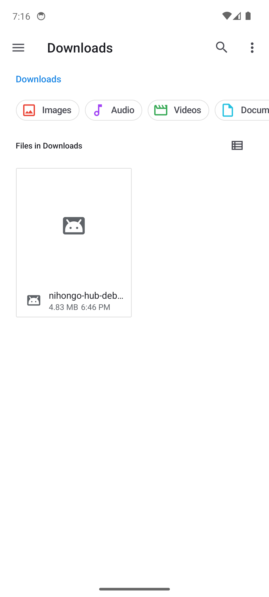
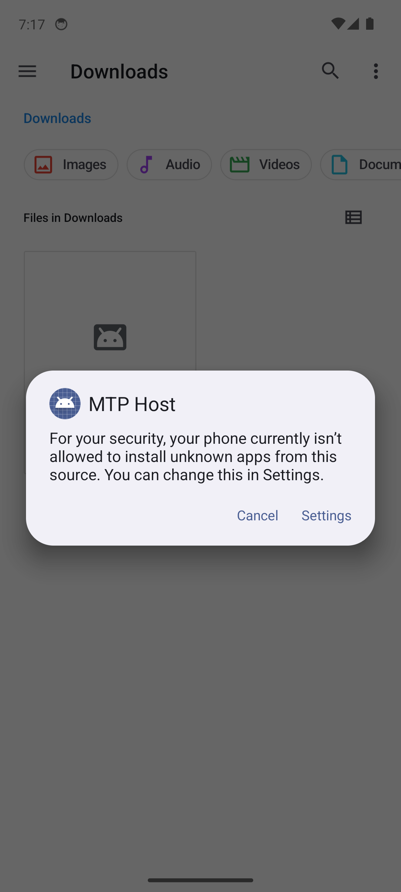
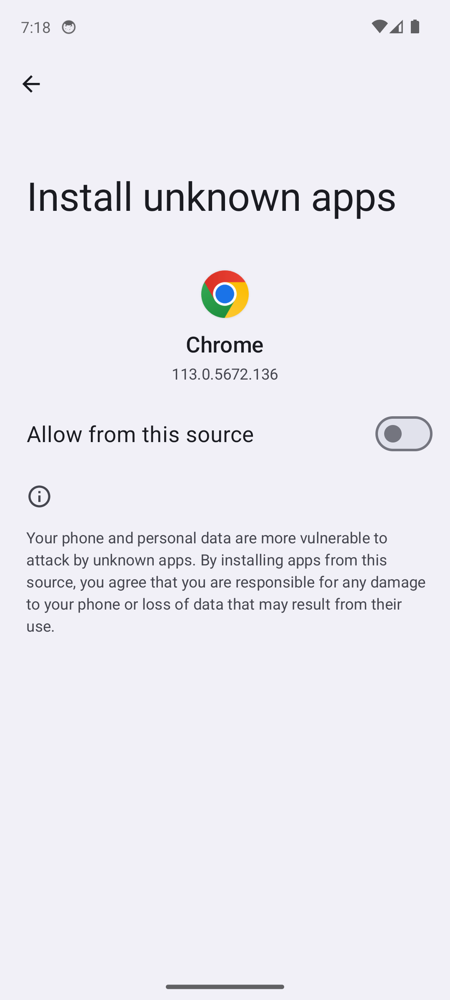
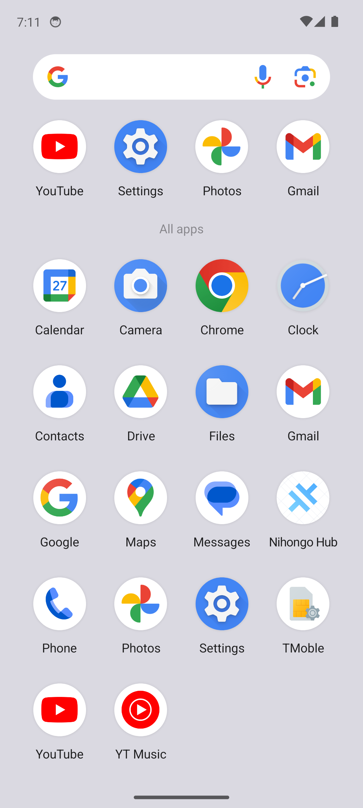
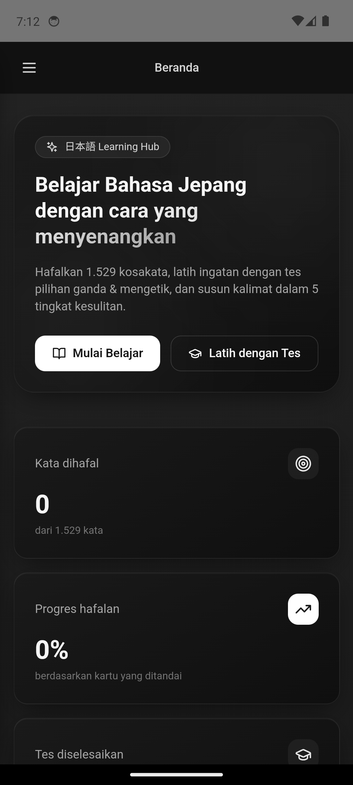
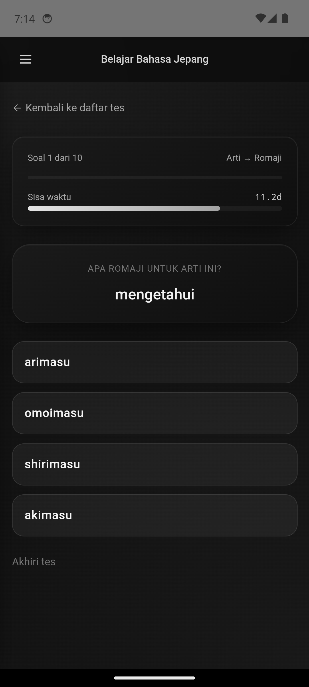

# Panduan Install Nihongo Hub di HP Android (Step-by-Step + Screenshot)

Panduan visual ini menunjukkan **persis apa yang akan kamu lihat di HP** saat install APK Nihongo Hub. **Tidak perlu hosting, tidak perlu URL, tidak perlu internet** — APK adalah aplikasi mandiri yang langsung jalan di HP setelah di-install.

> File APK: `nihongo-hub-debug.apk` (±4.83 MB)

---

## Langkah 1 — Pindahkan APK ke HP

Pilih salah satu cara untuk memindahkan file APK ke HP Android:

| Cara | Langkah |
|---|---|
| **Kabel USB** | Sambungkan HP → PC, mode "File Transfer", copy ke folder `Download` |
| **WhatsApp** | Kirim file ke "WA sendiri" / chat → tap "Download" di HP |
| **Google Drive** | Upload dari PC → buka Drive di HP → "Download" file ke HP |
| **Email** | Kirim ke email kamu → buka email di HP → tap "Download" |
| **Bluetooth** | Pairing HP-PC, lalu kirim file |

Setelah pindah, buka **File Manager** / **Files** / **My Files** di HP dan masuk ke folder **Download**.

---

## Langkah 2 — Tap File APK di File Manager

Di folder Download, kamu akan lihat file `nihongo-hub-debug.apk` (4.83 MB). **Tap file tersebut**.



---

## Langkah 3 — Dialog "Izinkan Install dari Sumber Ini"

Pertama kali install APK dari aplikasi tertentu (File Manager / WhatsApp / Drive / Chrome), Android akan tampilkan dialog keamanan seperti ini:



Tulisannya: **"For your security, your phone currently isn't allowed to install unknown apps from this source. You can change this in Settings."**

Tap tombol **Settings** (atau **Setelan** di HP berbahasa Indonesia).

---

## Langkah 4 — Aktifkan Toggle "Allow from this source"

Android akan membuka halaman izin khusus untuk aplikasi yang kamu pakai. Ada toggle **"Allow from this source"** / **"Izinkan dari sumber ini"**. **Aktifkan toggle-nya** (warnanya berubah dari abu-abu jadi biru/hijau).



Setelah toggle ON, tekan tombol **Back (←)** di pojok kiri atas. Android akan kembali ke dialog install.

> **Catatan:** Izin ini hanya perlu diberikan **sekali per aplikasi**. Setelah di-aktifkan untuk WhatsApp/Files/Chrome, Android tidak akan tanya lagi untuk install APK berikutnya dari sumber yang sama.

---

## Langkah 5 — Tap "Install"

Setelah izin diberikan, Android akan tampilkan dialog konfirmasi install:

```
Nihongo Hub
Do you want to install this app?
                          [Cancel]  [Install]
```

Tap **Install**. Tunggu sekitar 5-15 detik (tergantung kecepatan HP). Selesai, akan muncul:

```
Nihongo Hub
✓ App installed
                          [Done]  [Open]
```

Tap **Open** untuk langsung buka aplikasi, atau **Done** untuk balik ke File Manager.

---

## Langkah 6 — Cari Icon "Nihongo Hub" di HP

Kalau kamu tap "Done" tadi, aplikasi sekarang ada di:
- **Home screen** HP (otomatis ditambahkan di beberapa HP)
- **App drawer** (geser ke atas dari home screen)

Cari icon dengan nama **"Nihongo Hub"** — icon-nya bulat warna biru terang dengan logo Android (default Capacitor):



**Tap icon Nihongo Hub** untuk membuka aplikasi.

---

## Langkah 7 — Aplikasi Terbuka

Aplikasi langsung terbuka dengan halaman **Beranda**:



Tampak:
- Judul: 日本語 Learning Hub
- Deskripsi: "Belajar Bahasa Jepang dengan cara yang menyenangkan"
- Tombol **Mulai Belajar** dan **Latih dengan Tes**
- Stat: "0 dari 1.529 kata", "Progres hafalan 0%"
- Menu hamburger (☰) di pojok kiri atas untuk navigasi

Kamu **tidak perlu login, tidak perlu daftar**. Langsung pakai.

---

## Langkah 8 — Coba Fitur Baru: Pilihan Ganda Arti → Romaji

Ini fitur baru yang kamu minta:

1. Tap menu (☰) → **Tes**
2. Tap card **Pilihan Ganda** → tap **Mulai**
3. Di config tes, pilih **Arah Soal → "Arti → Romaji"**
4. Pilih halaman kosakata (misal Kata Kerja Hal. 1) → scroll ke bawah → **Mulai Tes**

Soalnya akan tampak seperti ini:



- Pertanyaan: arti dalam bahasa Indonesia (mis. **"mengetahui"**)
- 4 pilihan dalam **romaji** (mis. arimasu, omoimasu, **shirimasu**, akimasu)
- Pilih jawaban yang benar dalam 15 detik

---

## Langkah 9 — Tes Mode Offline

Untuk membuktikan aplikasi 100% offline:

1. Aktifkan **mode pesawat** ✈️ (geser status bar dari atas → tap icon pesawat)
2. Tutup aplikasi (back / swipe up)
3. Buka lagi aplikasi Nihongo Hub

Aplikasi tetap kebuka dan jalan normal tanpa koneksi:


Perhatikan icon **pesawat ✈️** di status bar (bukan sinyal/WiFi). Semua fitur tetap jalan:
- Kosakata (1.529 kata)
- Tes (Pilihan Ganda, Mengetik, Susun Kalimat, Choukai, Dokkai, JLPT N4)
- Tata Bahasa, Konjugasi, Kaigo
- Statistik & Catatan Harian (disimpan di HP)

---

## Pelafalan / TTS Offline (Opsional)

Aplikasi pakai **Text-to-Speech (TTS) bawaan Android** untuk pelafalan kosakata Jepang. Agar suara jalan **tanpa internet**, install voice data Jepang sekali saja:

1. Buka **Settings (Setelan) HP** → **System** → **Languages & input** → **Text-to-speech output**
2. Pilih engine: **Google text-to-speech** (atau **Samsung TTS** kalau HP Samsung)
3. Tap ⚙️ (gear) di samping engine → **Install voice data** / **Install language**
4. Pilih **Japanese (日本語)** → **Download**

Setelah selesai, suara Jepang akan jalan tanpa internet di seluruh aplikasi.

---

## Troubleshooting

| Masalah | Solusi |
|---|---|
| "App not installed" / "Parse error" | File APK rusak saat transfer. Download ulang & coba lagi. |
| "Install blocked" | Belum aktifkan "Allow from this source" (Langkah 4). Aktifkan dulu. |
| Icon tidak muncul di home | Buka app drawer (geser layar dari bawah ke atas). Icon ada di sana. |
| Layar kosong / loading lama | Force-stop aplikasi (Settings → Apps → Nihongo Hub → Force Stop), lalu buka lagi. |
| Suara TTS tidak jalan offline | Install voice data Jepang (lihat bagian "Pelafalan / TTS Offline" di atas). |
| Suara TTS volume kecil | Aktifkan **Media volume** (bukan Ring/Call volume) saat aplikasi terbuka. |
| HP Xiaomi / Realme / Oppo blokir install | Buka Settings → Privacy / Permissions → matikan "Install via USB" warning, atau lewat MIUI/ColorOS Settings → cari "Install unknown apps" |

---

## Catatan

- **APK ini debug build** — belum di-tanda-tangani untuk Play Store. Aman dipakai pribadi, tapi tidak bisa dipublish ke Play Store sebelum proses signing.
- **Tidak perlu update manual**. Kalau ada versi baru, tinggal install APK baru di atas yang lama (akan otomatis overwrite, data tetap).
- **Tidak ada iklan, tidak ada tracking, tidak ada server**. Semua data disimpan lokal di HP kamu.

---

Selamat belajar bahasa Jepang! 🇯🇵
